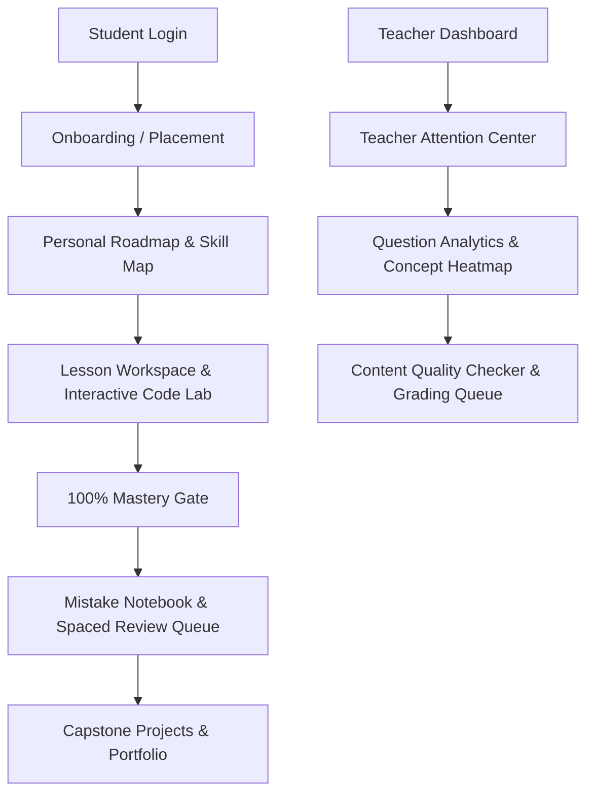

# Enhancement Architecture & Differentiation Model — نواة كود (nawa-code)

**تاريخ التوثيق والتطوير**: 30 يوليو 2026  
**الهدف المعماري**: تحويل المنصة إلى مساحة تدريب برمجي شخصية متميزة للناشئين (10 - 15 سنة).

---

## 1. الهيكل الهندسي للمزايا المستحدثة

---

## 2. المسارات والخدمات المضافة
- **Onboarding & Placement**: `OnboardingPage.tsx`, `PlacementPage.tsx`, `onboardingService.ts`.
- **Roadmap & Skill Map**: `PersonalRoadmapPage.tsx`, `SkillMapPage.tsx`, `skillService.ts`.
- **Mistake Notebook & Spaced Review**: `MistakeNotebookPage.tsx`, `ReviewCenterPage.tsx`, `mistakeService.ts`, `reviewService.ts`.
- **Projects & Portfolio**: `ProjectsPage.tsx`, `projectService.ts`.
- **Missions & Calendar**: `MissionsPage.tsx`, `StudentCalendarPage.tsx`.
- **Teacher Attention Center**: `TeacherAttentionPage.tsx`, `attentionService.ts`.
